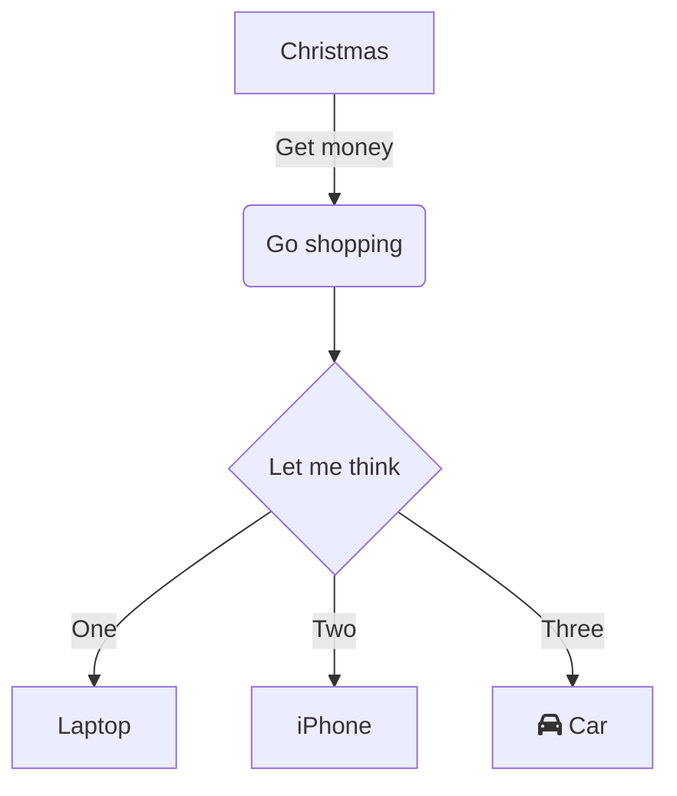
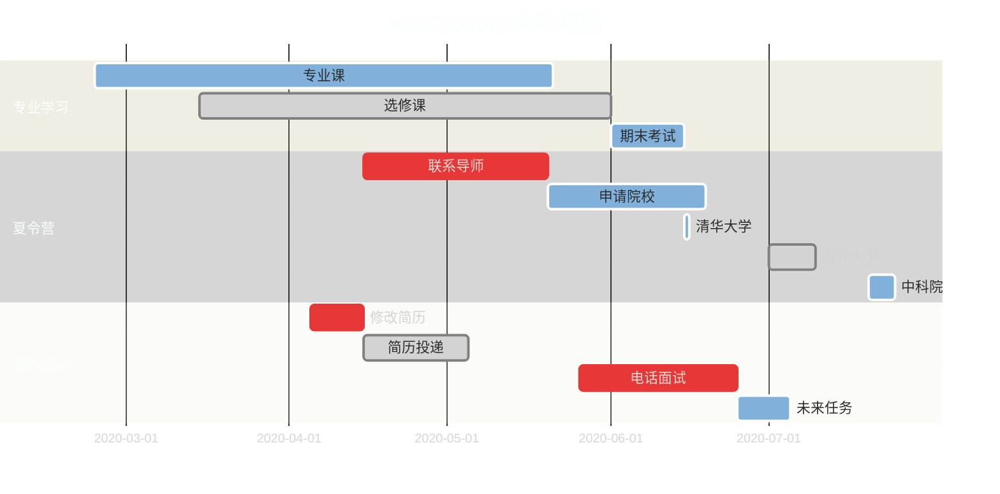

## Test

```mermaid
graph TD
    A[Christmas] -->|Get money| B(Go shopping)
    B --> C{Let me think}
    C -->|One| D[Laptop]
    C -->|Two| E[iPhone]
    C -->|Three| F[fa:fa-car Car]
  
```

```mermaid
%%{init: {'theme': 'dark' } }%%
gantt
	dateFormat YYYY-MM-DD
	title XXX 2020上半年规划
	
	section	专业学习
		专业课	: active, name1, 2020-02-24, 2020-05-21
		选修课 : done, name2, 2020-03-15, 2020-06-01
		期末考试 : active, name3, after name2, 14d
		
	section 夏令营
		联系导师 : crit, name11, 2020-04-15, 2020-05-20
		申请院校 : active, name22, after name11, 30d
		清华大学 : active, name33, after name3, 1d
		南开大学 : done, name44, 2020-07-01, 2020-07-10
		中科院 : active, name55, 2020-07-20, 5d
		
	section 公司实习
    	修改简历 : crit, name111, 2020-04-05, 10d
    	简历投递 : done, name222, after name111, 20d
    	电话面试 : crit, name333, 2020-05-26, 30d
    	未来任务 : active, after name333, 10d
```